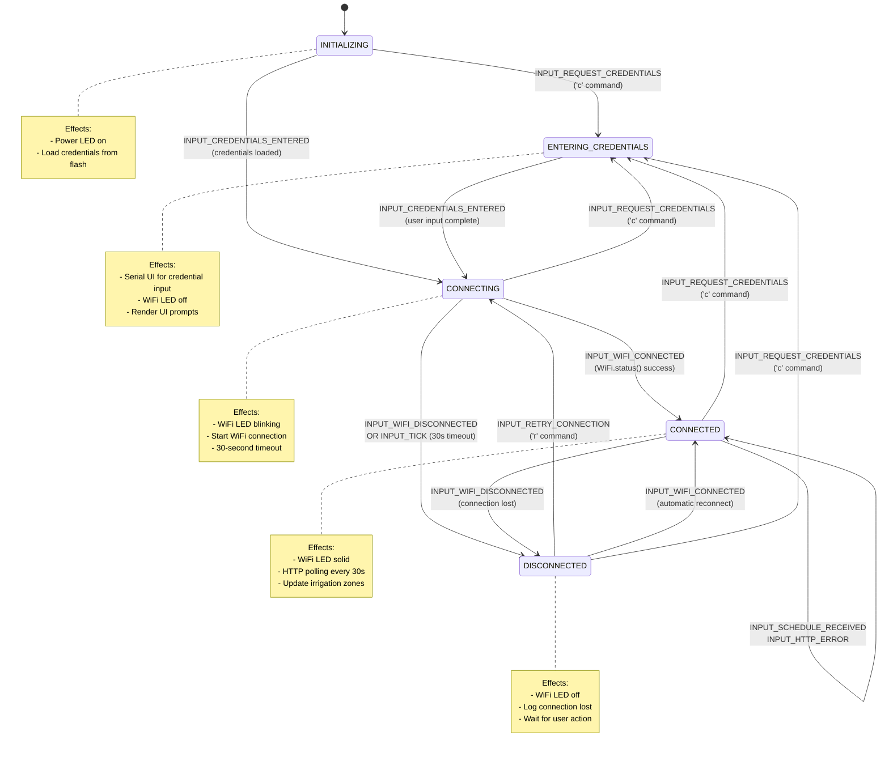

# Irrigation Control System

This is an irrigation control system with two main components:
1. **Arduino Controller** - C++ firmware for an Arduino Giga R1 WiFi board implementing a Moore state machine for controlling solenoid valves.
2. **Haskell Web Server** - Backend API server built with Servant for irrigation scheduling.

## Architecture

### Arduino Controller State Machine

The Arduino controller implements a Moore finite state machine for WiFi connection management and irrigation scheduling. The state machine handles WiFi connectivity, user credential input, and HTTP polling for irrigation schedules.



#### Key Input Events

- `INPUT_REQUEST_CREDENTIALS` - User pressed 'c' to enter new credentials
- `INPUT_RETRY_CONNECTION` - User pressed 'r' to retry connection
- `INPUT_WIFI_CONNECTED` - Hardware detected successful WiFi connection
- `INPUT_WIFI_DISCONNECTED` - Hardware detected WiFi connection loss
- `INPUT_TICK` - Timer event for timeout checks and periodic operations
- `INPUT_SCHEDULE_RECEIVED` - HTTP response with irrigation schedule received
- `INPUT_HTTP_ERROR` - HTTP request failed
- `INPUT_CREDENTIALS_ENTERED` - User completed credential entry

## Development

### Quick Start

```bash
# Build Haskell web server
just build

# Build Arduino controller
just arduino-build

# Start development environment
nix develop
```

## Components

### Arduino Controller (`controller/`)
- `controller.ino` - Main Arduino sketch with Moore state machine
- `StateMachine.{h,cpp}` - Pure functional state machine implementation
- `WiFiConnection.{h,cpp}` - WiFi connection management
- `WiFiCredentials.{h,cpp}` - Credential storage/retrieval from flash
- `IrrigationController.{h,cpp}` - Main controller logic
- `Types.h` - State machine type definitions

### Web Server (`web-server/`)
- `app/Main.hs` - Application entry point
- `src/WebServer.hs` - Servant API implementation
- `migrations/` - SQL database migrations

## License

See [LICENSE](LICENSE) for details.
